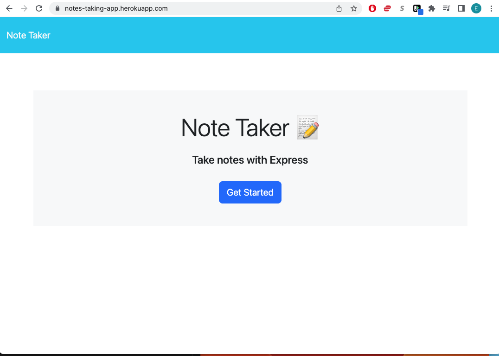

# <Note-Taking-App>

## Description

This is a very simple full stack application that allows a user to write and save notes for future reference

- I was motivated to do this because my favorite note taking app Color Note is not available on my new phone.
- I was frustrated that I lost access to all my old notes and I decided to make my own application to take notes
- It solves the problem of me not having a reliable way to take notes 
- I learned that modularization is very complicated and extremely simple at the same time.
- I learned the basics of using Heroku

## Installation

There's nothing to install. Just use the link provided below

## Usage

Just follow this link. The home page will look like the image below.

https://notes-taking-app.herokuapp.com/

If you have any problems watch this video

https://watch.screencastify.com/v/qEuLSqoZlZyYXoX1wNpw

    

## Credits
Developer- Everitt Gill

Github- https://github.com/EverittGill

Tutorials followed- GA Tech fullstack development bootcamp resources and classes

## License
MIT License

## Features

- Writing and Saving Notes
- Viewing previously made notes

